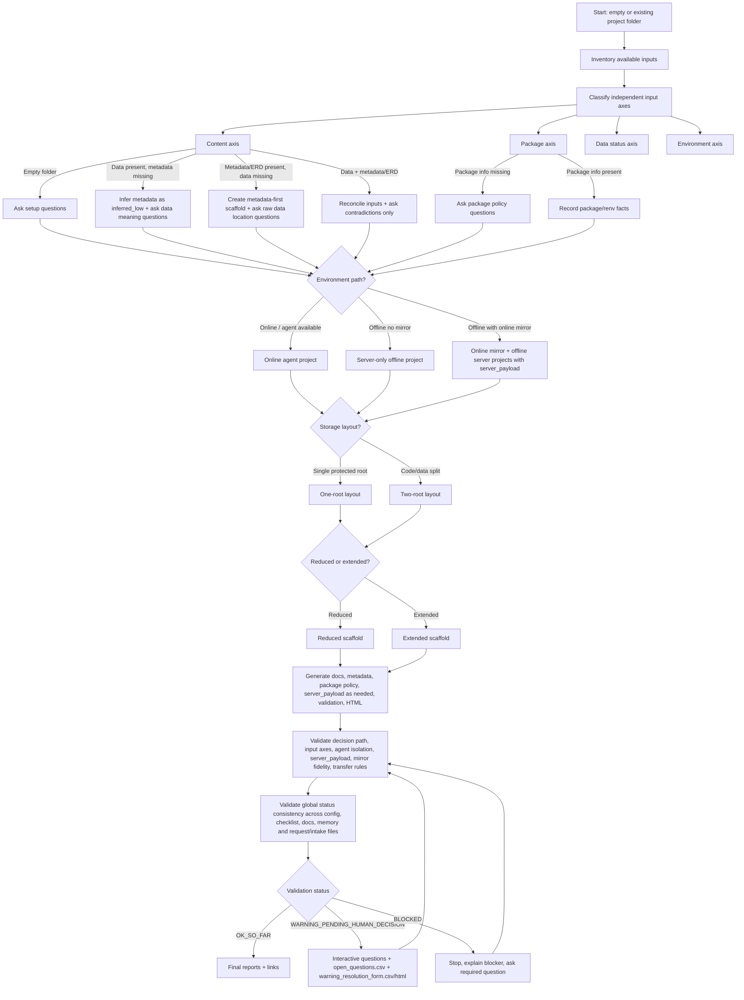

# Decision Algorithm

Use this as both human-readable flowchart and implementation checklist.

## Input Axes

Record these axes separately in `config/project.yml`. They are compatible with each other, not mutually exclusive.

| axis | possible values |
|---|---|
| content | empty_folder; data_present; metadata_dictionary_present; erd_schema_present; notes_protocol_present; codelists_mappings_initial_present; codelists_mappings_derived_present |
| package | no_package_information; machine_universal_inventory_present; project_renv_subset_present; scope_unknown; complete_inventory_pending; renv_lock_present; package_policy_unknown |
| data_status | simulated; real; unknown |
| environment | online_with_agent; offline_no_mirror; offline_with_online_mirror |

Example: `data_present + package_list_missing + simulated + offline_with_online_mirror` is valid.

## Blocking Questions

Use these only when not discoverable from files.

| decision | question | choices |
|---|---|---|
| structure | Should this project use reduced or extended structure? | reduced; extended |
| environment | What environment path applies? | online with agent; offline no mirror; offline with online mirror |
| storage | Where will sensitive raw data and private metadata live? | single protected root; code/data split |
| data status | Are available data simulated, real or unknown? | simulated; real; unknown |
| package policy | Can the project download new R packages? | yes online; no package requests only; offline existing binaries only |
| package scope | Is this package list the complete server/PC package inventory, or only this project's renv subset? | complete machine/server inventory; project renv subset; unknown |
| renv | How should renv be handled offline? | restore from existing local binaries; document package requests only |
| server transfer | Should agent files be excluded from server transfer? | yes; no explicit exception |

## Server Payload Validation

In online mirror workflows:

- all server-bound artifacts must live under `server_payload/`;
- no `.codex/`, `.agents/`, `AGENTS.md`, `MEMORY.md` or `docs/agent_context/` may exist inside `server_payload/`;
- no production server-bound scripts, docs or config may be scattered outside `server_payload/`;
- `server_payload/` must be copyable as one unit to the offline server code root;
- future production scripts must be documented as belonging in `server_payload/scripts/`.
- scaffold-only utilities may live under `server_payload/tools/` if they are documented as non-analysis utilities and do not touch raw/protected data.

## Validation Checks

Validation must confirm:

- `config/project.yml` records selected environment, storage layout, structure level and data status.
- `config/project.yml` records content, package, data status and environment axes separately.
- Required artifacts exist for the selected path.
- Agent files exist only in agent-enabled roots.
- Server roots contain no `.codex/`, `.agents/`, `AGENTS.md`, `MEMORY.md`, or agent orchestrator docs unless explicitly allowed.
- Mirror and server scaffolds share project ID, metadata schema, source inventory, package plan and transfer contract.
- Simulated mirror data are labelled simulated.
- Real-data destinations are labelled protected.
- Package policy is embedded in README, `.Rprofile`, `AGENTS.md`/`MEMORY.md` when relevant, and package docs.
- Package inventory scope is explicit: complete machine/server inventory, project renv subset, or unknown.
- If package scope is unknown, `open_questions.csv` includes a required scope question.
- If status is `WARNING_PENDING_HUMAN_DECISION`, `warning_resolution_form.csv` and `docs/warning_resolution_form.html` exist and link each warning to closed choices plus a free-text field.
- If encoding-sensitive text inputs are present, tested encodings, preview evidence and a recommended setup are recorded separately from human semantic readability status.
- If only a project renv subset exists, validation warns that the complete server/PC package inventory is pending unless explicitly waived.
- Packages missing from a project renv subset are not assumed unavailable on the server.
- No `inferred_low` or `inferred_medium` value is marked verified.
- Open questions remain visible until answered.
- Current status is consistent across `config/project.yml`, `scaffold_validation_checklist.csv`, README/MEMORY files, HTML reports and current plan request files.
- Historical intake/request artifacts with older statuses are marked `superseded_by_iteration` or they trigger a warning.

## Plan Request Inbox

When an interactive warning form submits answers or uploads, prefer a safe Plan Request Inbox under the active metadata root:

- `plan_requests/<timestamp>/request.json`
- `plan_requests/<timestamp>/request_manifest.csv`
- `plan_requests/<timestamp>/codex_plan_prompt.md`
- `plan_requests/<timestamp>/REQUEST_STATUS.md`
- `plan_requests/<timestamp>/uploads/`

The request status starts as `pending_codex_plan_review`. The user-facing instruction is the short chat command: `review latest scaffold plan request`. The helper must not launch Codex Desktop or a separate Codex CLI session.

## Status Rules

- `OK_SO_FAR`: all checks pass for answered decisions.
- `WARNING_PENDING_HUMAN_DECISION`: scaffold is usable but questions remain.
- `BLOCKED`: unsafe to transfer or use.
